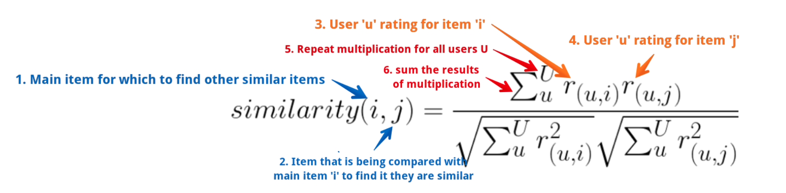
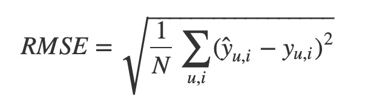
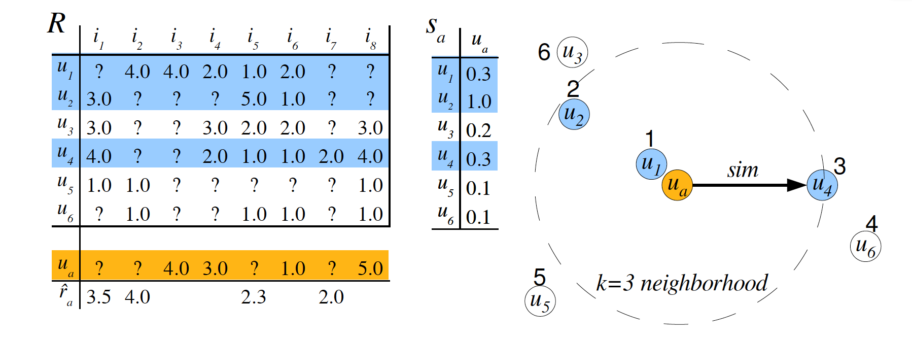
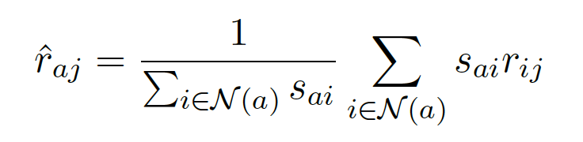

<br/>

#### URL: https://teammak.shinyapps.io/project4/  

A second URL that has the same deployment is provided as a backup  
URL (2): https://makteam.shinyapps.io/Project4/  

<br/>

```{r setup, include=TRUE}
knitr::opts_chunk$set(echo = TRUE)
```

### Objective

The objective of this project is to build two systems for movie recommendation using the **MovieLens 1M Dataset**. The dataset contains about 1 million anonymous ratings of approximately 3,900 movies made by 6,040 MovieLens users who joined MovieLens in 2000. We'll build two systems:  

-    **System I** - will recommend movies based on **genres**.  
-    **System II** - will be a **collaborative recommendation** system.  

For each of the systems, we'll explore two algorithms.

### Library Setup
```{r report-1, warning=FALSE,message=FALSE}
library(dplyr)
library(ggplot2)
library(DT)
library(data.table)
library(reshape2)
library(recommenderlab)

set.seed(1234)
```

### Data Preprocessing

We first downloaded the movies and ratings dataset to the data folder. Next we read in the dataset from the data folder.  
For the ratings data, we remove the 'Timestamp' column as it doesn't seem to be a contributing factor.  

```{r report-2}
#myurl = "https://liangfgithub.github.io/MovieData/"
#ratings = read.csv(paste0(myurl, 'ratings.dat?raw=true'), sep = ':', colClasses = c('integer', 'NULL'), header = FALSE)

ratings = read.csv('data/ratings.dat', sep = ':', colClasses = c('integer', 'NULL'), header = FALSE)
colnames(ratings) = c('UserID', 'MovieID', 'Rating', 'Timestamp')
ratings$Timestamp = NULL # Timestamp doesn't seem to be a contributing factor
```

In the movies data, some movie names contain single colon (:), so the above method doesn't work. So we split the movies data columns by using explicit separator (::) and then form the movies data matrix. Further, any accented characters are converted to UTF-8 encoding.  

```{r report-3}
# Movie pre-processing
#movies = readLines(paste0(myurl, 'movies.dat?raw=true'))
movies = readLines('data/movies.dat')
movies = strsplit(movies, split = "::", fixed = TRUE, useBytes = TRUE)
movies = matrix(unlist(movies), ncol = 3, byrow = TRUE)
movies = data.frame(movies, stringsAsFactors = FALSE)
colnames(movies) = c('MovieID', 'Title', 'Genres')
movies$MovieID = as.integer(movies$MovieID) # convert char to integer

# convert accented characters
movies$Title = iconv(movies$Title, "latin1", "UTF-8")
# extract year
movies$Year = as.numeric(unlist(lapply(movies$Title, function(x) substr(x, nchar(x)-4, nchar(x)-1))))
```


### Movies dataset
Here's a look at the movies dataset.  

```{r report-4}
head(movies, 6)
```


### Ratings dataset
Here's a look at the ratings dataset.  

```{r report-5}
head(ratings, 6)
```

### System I

#### System I, Approach 1 - Recommendation based on Genres (Using Weighted score, shrinkage estimator)

For System I, Approach 1, we use a slightly modified weighted ratings method based off of IMDB's approach which is used to display top 250 movies on their main website. The weighted score is produced by the following equation:

$$
WR = (\frac{v}{v+m}) * R + (\frac{m}{v+m})*C
$$
where,

- $R=$ mean rating
- $v=$ number of votes
- $m=$ minimum votes to appear in top 250
- $C=$ mean rating across corpus of movies

The modification to this scoring method is to base the means of $R$ and $C$ within specific genres. IMDB also sets a value for $m$ based on the minimum number of votes for a movie to appear in top 250 which is currently at 25,000. In our implementation, $m$ is determined on minimum number of votes to appear in top 50 of genre. We did not use the 25,000 vote threshold IMDB uses, because some genres, such as documentaries have far fewer votes than more popular ones and could produce some odd results.

The idea behind this rating system is to give more weight to the individual movie's ratings the more votes they receive, otherwise, the corpus average is more heavily weighted. This is commonly and somewhat colloquially referred to as a Bayesian average as it is using an averaged prior across the corpus (in this case, the specific genre).

For our application, the weighted average scores are produced for every movie in the chosen genre with the top 10 ranked displayed in the interface.

<br/>

#### References: 
- https://help.imdb.com/article/imdb/track-movies-tv/ratings-faq/G67Y87TFYYP6TWAV#
- https://en.wikipedia.org/wiki/Bayesian_average

<br/>

```{r report-6}

get_top_rated_movies_in_genre_weighted <- function(selected_genre, count=10, my_top_n=50) {

  if (!is.na(selected_genre)) {
    filtered_movies_genre <- movies %>% filter(grepl(selected_genre, Genres)) 
  } else {
    filtered_movies_genre <- movies
  }
  
  ratings_in_genre <- ratings %>% 
    group_by(MovieID) %>% 
    summarize(ratings_per_movie = n(), ave_ratings = round(mean(Rating), dig=3)) %>%
    inner_join(filtered_movies_genre, by = 'MovieID')
  C <- mean(ratings_in_genre$ave_ratings)
  
  top_votes <- ratings_in_genre %>%
    top_n(my_top_n, ratings_per_movie) %>%
    arrange(desc(ratings_per_movie))
  m <- min(top_votes$ratings_per_movie)
  
  top_rated_in_genre <- 
    mutate(ratings_in_genre, weighted_rating = 
      (ratings_per_movie /  (ratings_per_movie + m)) * ave_ratings + 
      (m / (ratings_per_movie + m)) * C) %>%
    top_n(count, weighted_rating) %>%
    arrange(desc(weighted_rating))
  
  return(top_rated_in_genre)
}
selected_genre = "Comedy" # Say this is what the user selected
top_10_movies <- get_top_rated_movies_in_genre_weighted(selected_genre, count = 10)
top_10_movies
```

<br/>

#### System I, Approach 2 - Based on popularity using recommenderlab 

For System I, Approach 2, we have used the method = POPULAR to create our recommender object. 
The idea here is to show the users the most popular movies and take help from top users who have rated multiple movies as they would seem to be more engaged in the movie review process. 
Since system 1 doesn't have the logged-in user preferences, it doesn't matter which users are selected as long as those users are highly engaged.
 
**Note**: We have not taken year of make into consideration, since user may prefer to watch old but good movies.
      Also this implementation does have a slower performance compared to system 1, approach 1 since the Rating Matrix(Rmat) in spite of being filtered down by genre and top users, is still quite big.
 
  **a)** We have first defined how the utility matrix should be created.  
  **b)** Since the requirement for system 1 is based on the selected 'Genre', it seemed very important to filter out movies of specific Genre first. For this we have used 'grepl' function to filter out the movies.  
  **c)** A list of say 2000 top users who have given the most ratings is retrieved.  
  **d)** recom_ratings - this realRatingMatrix object would store complete ratings (Actual / Predicted) and for that 'ratingMatrix' type is set. The dataframe will be further modifed for user and item to UserID and MovieID settings.  
  **e)** recom_topNList - this type would help us get the top 10 recommended movies by the top users.   
  **f)** recom_ratings_df.new.grouped - since the predicted ratings can cross 5 or be negative, we have simply taken average here.  
  **g)** Finally top 10 rated recommended movies are displayed and it did seem to reflect top rated movies (8.0) and above on actual IMDB site as well.  


#### Create a utitlity matrix
```{r report-7}
create_utility_matrix <- function(input_data) {
  i = paste0('u', input_data$UserID)
  j = paste0('m', input_data$MovieID)
  x = input_data$Rating
  tmp = data.frame(i, j, x, stringsAsFactors = T)
  Rmat = sparseMatrix(as.integer(tmp$i), as.integer(tmp$j), x = tmp$x)
  rownames(Rmat) = levels(tmp$i)
  colnames(Rmat) = levels(tmp$j)
  Rmat = new('realRatingMatrix', data = Rmat)
  return (Rmat)
}
```

<br/>
```{r report-8}
get_top_users_rated_movies <- function (selected_genre, count = 2000) {
  
  #filter the movies by genre as usual
  filtered_movies_genre <- movies %>% filter(grepl(selected_genre, Genres)) 
  # use ratings from user who might have reviewed the same genre.
  filtered.ratings <- ratings %>% filter(MovieID %in% filtered_movies_genre$MovieID)
  
  top_users_rated_movies <- filtered.ratings %>% group_by(MovieID) %>% 
    summarize(ratings_per_movie = n(), ave_ratings = round(mean(Rating), dig=3)) %>%
    filter(ratings_per_movie > 1000) %>%
    top_n(count, ave_ratings) %>%
    arrange(desc(ave_ratings)) 
    
  return (top_users_rated_movies)
}

get_top_rated_movies_based_on_popularity <- function(selected_genre, count=10) {
  
   #filter the movies by genre as usual
  filtered_movies_genre <- movies %>% filter(grepl(selected_genre, Genres))
  # use ratings from user who might have reviewed the same genre.
  filtered.ratings <- ratings %>% filter(MovieID %in% filtered_movies_genre$MovieID)

  ## select top users who have rated the specific genre:
  top_users <- get_top_users_rated_movies(selected_genre, count = 2000)
  filtered.ratings <- filtered.ratings %>% filter(MovieID %in% top_users$MovieID)
  
  # Utility matrix creation
  Rmat <- create_utility_matrix(filtered.ratings)
  
  # POPULAR - Model creation
  rec_popular = Recommender(Rmat, method="POPULAR")
  
  # Complete predicted matrix (including original ratings by users). 
  recom_ratings = predict(rec_popular, Rmat,type = 'ratingMatrix')
  recom_ratings_df = as(recom_ratings,'data.frame')
  
  #clean up df
  recom_ratings_df.new <- recom_ratings_df
  recom_ratings_df.new$user <- as.numeric(sub('.', '', (recom_ratings_df$user)))
  recom_ratings_df.new$item <- as.numeric(sub('.', '', (recom_ratings_df$item)))
  colnames(recom_ratings_df.new) <- c('UserID', 'MovieID', 'Pred.Rating')
  
  # Return top-N recomendations. Extract results from recom_topNlist object
  recom_topNList = predict(rec_popular, Rmat, n = 10, type = 'topNList')
  best_10_df <- (as(bestN(recom_topNList, n = 10), 'list'))
  best_10_unique_movies <- list() 
  for (i in 1:length(best_10_df)) {
    best_10_unique_movies <- append(best_10_unique_movies, best_10_df[[i]])
  }
  best_10_unique_movies <- unlist((unique(best_10_unique_movies)))
  best_10_unique_movies <- as.numeric(sub('.', '', (best_10_unique_movies)))
  
  # group by predicted/actual ratings and retrieve top-10. here I have averaged the predicted 
  # ratings such that different movies could come up in the list
  recom_ratings_df.new <- recom_ratings_df.new %>% filter(MovieID %in% best_10_unique_movies)
  recom_ratings_df.new.grouped <- recom_ratings_df.new %>% group_by(MovieID) %>% 
    summarize(ratings_per_movie = n(), ave_ratings = round(mean(Pred.Rating), dig=3)) %>%
    top_n(count, ave_ratings) %>% arrange(desc(ave_ratings))
  
  recom_ratings_df.new.grouped <- recom_ratings_df.new.grouped %>% inner_join(movies, by='MovieID')
  
  top_rated_in_genre <- data.table(Rank = 1:10, MovieID = recom_ratings_df.new.grouped$MovieID, 
                          Title = recom_ratings_df.new.grouped$Title, 
                          Predicted_rating =  recom_ratings_df.new.grouped$ave_ratings)
  
  return(top_rated_in_genre)
}

selected_genre <- 'Comedy'
top_10_movies <- get_top_rated_movies_based_on_popularity(selected_genre, count = 10)
top_10_movies
```

<br/>

### System II  - Recommendation based on Rating (UBCF, IBCF, SVD)

We have further used the packages/functions available in R for our system 2 implementation. 
We have tried to evaluate all the models based on RMSE, run-time, ROC, and balance of precision vs recall error.

- **Approach 1** - The first approach is using UBCF since the training time was less compared to IBCF and 
hence helped reducing the overall computation cost on the already constrained Shiny Server app. The disadvantage 
of this approach is scalability since the whole user dataset is considered. It's a memory-based algorithm which 
tries to mimic word-of-mouth by analyzing rating data from many individuals. The assumption is that users with 
similar preferences will rate items similarly and missing ratings get predicted by first finding a "neighborhood" 
of similar users and then aggregating the ratings of these users to form a prediction.

- **Approach 2** - The second approach was using IBCF. It was developed by Amazon in 1998 and had dramatically 
improved the scalability of recommender systems. IBCF has a higher computation cost compared to UBCF when doing 
training but predictions are much faster. IBCF is a generally preferred option with internet giants.

- **Rating Utility Matrix** - The utility matrix once normalized does showcase the distribution for method 'Center'
and 'Z-score'. With Z-score we observe the values centers more towards zero since it considers the standard deviation
during the computation. Basically, negative values adjust more towards less negative side and positive towards less
positive side.
```{r report-1-bis}
Rmat = create_utility_matrix(ratings)
hist(getRatings(normalize(Rmat, method="Center")), breaks=100, col="lightblue",
     main="Histogram for Center normalized ratings",
     xlab="Center normalized ratings",
     border="black")
```

```{r report-2-bis}
hist(getRatings(normalize(Rmat, method="Z-score")), breaks =100, col="lightyellow", 
     main="Histogram for Z-score normalized ratings",
     xlab="Z-score normalized ratings",
     border="black")
```


<br/>

#### System II, Approach 1 - UBCF (User-based collaborative filtering)  


##### Step 1: Retrieve top movies which have been heavily rated by different users.  
This defines the popularity of such movies are high amongst the general population.
```{r report-9}
retrieve_top_rated_users <- function(top_count=2000, is_unique_genre = TRUE, is_unique_movie=TRUE) {

  selected_genre <- NA # Since we need to collect all unique genres
  top_rated_movies <- get_top_rated_movies_in_genre_weighted(selected_genre, count=top_count)
  
  if (is_unique_genre) {
    top_rated_movies <- top_rated_movies %>% distinct(Genres, .keep_all = TRUE)
  }
    
  if (is_unique_movie) {
    top_rated_movies <- top_rated_movies %>% 
      mutate(first_two_words_movie_name = sub("(\\w+\\s+\\w+).*", "\\1", Title)) %>%
      distinct(first_two_words_movie_name, .keep_all = TRUE)
  }
    
  return (top_rated_movies)
}

top_rated_movies_by_genre <- retrieve_top_rated_users()
filtered_top_rated_movies <- ratings %>% filter (ratings$MovieID %in% top_rated_movies_by_genre$MovieID)
```

<br/>

##### Step 2: Collect User Input and Create new rating matrix

An additional step here can be introduced to further reduce selected genres based on user input.  
**Note**: Since it's possible that user selects less number of movies, the filtering and then prediction
may reduce the movies to such an extent that no movies are shown. Hence it's avoided in actual implementation.

```{r report-10}
# Below is a sample scenario
user_movie_ids <- c(608, 648, 3471) # user rated movie ids
user_movie_ratings <- c(4,3,5) # user input ratings


#ADDITIONAL STEP (not in actual server implementation): 
#find the genre of these movies and filter further such movies from ratings
retrieve_unique_selected_genres <- function (user_movie_ids) {
  input_generes <- movies %>% filter (MovieID %in% user_movie_ids)
  input_genres_list <- tstrsplit(input_generes$Genres, '[|]', type.convert=TRUE)
  input_unique_genre_list <- list()

  for (i in 1:length(input_genres_list)) {
    input_unique_genre_list <- append(input_unique_genre_list, input_genres_list[[i]])
  }
  input_unique_genre_list <- input_unique_genre_list[!is.na(input_unique_genre_list)]
  input_unique_genre_list <- (unlist((unique(input_unique_genre_list))))
  
  return (input_unique_genre_list)
}

input_generes <- retrieve_unique_selected_genres(user_movie_ids)
input_generes # unique genres selected.
filtered_top_rated_movies <- filtered_top_rated_movies %>% inner_join(movies, by='MovieID') %>%
  filter(grepl(input_generes, Genres))

# remove the joined values
filtered_top_rated_movies$Title <- NULL
filtered_top_rated_movies$Genres <- NULL
filtered_top_rated_movies$Year <- NULL


#user id is purposefully kept at 0 such that it can come up in the rating list as the top element.
user_input = data.frame(UserID=0, MovieID=user_movie_ids, Rating = user_movie_ratings)
new.train <- rbind(user_input, filtered_top_rated_movies) # bring the user_input as top entry
user_util_mat <- create_utility_matrix(new.train)
```


<br/>

##### Step 3: Run UBCF Analysis 
```{r report-11}
# UBCF Collaborative methods
create_ubcf_training <- function(input_data) {
  rec_UBCF = Recommender(data = input_data, method='UBCF', parameter = 
                           list (normalize = 'Z-score', method = 'Cosine', nn = 25))
  return (rec_UBCF)
}

rec_model <- create_ubcf_training(user_util_mat)
# Predict ratings for the input user who is already top entry. user id = 0
recom = predict(rec_model, user_util_mat[1:1], n = 10,  type = 'topNList') 

# We can also see the exact predicted ratings by using ratingMatrix. ratingMatrix will also fill up already predicted ones.
recom_ratingMat = predict(rec_model, user_util_mat[1:1], n = 10,  type = 'ratingMatrix')
recom_ratingMatDf = as(recom_ratingMat,'data.frame')
recom_ratingMatDf$user <- as.numeric(sub('.', '', (recom_ratingMatDf$user)))
recom_ratingMatDf$item <- as.numeric(sub('.', '', (recom_ratingMatDf$item)))
colnames(recom_ratingMatDf) = c('UserID', 'MovieID', 'Pred.Rating')

best_10 = as(bestN(recom, n = 10), 'list')

user_predicted_ids = suppressWarnings(as.numeric(sub('.', '', (best_10[[1]]))))
final_filtered_movies <- movies[movies$MovieID %in% user_predicted_ids,]
final_filtered_movies <- final_filtered_movies %>% inner_join(recom_ratingMatDf, by='MovieID') %>%
  arrange(desc(Pred.Rating))

recom_results <- data.table(Rank = 1:10, 
                            MovieID = final_filtered_movies$MovieID, 
                            Title = final_filtered_movies$Title, 
                            Predicted_rating =  final_filtered_movies$Pred.Rating)

recom_results
```

<br/>

#### System II, Approach 2 - IBCF (Item-based collaborative filtering)

Only movies which have been rated again by top-rating-users are selected here. No additional filtering is done here. Item-to-Item similarity provides more reliable information because it's easier to find items in the same genre than it's to find users that like items of a single genre.


<br/>

##### Step 1: Collect User Input and Create new rating matrix as usual
```{r report-12}

top_rated_movies_by_genre <- retrieve_top_rated_users()
filtered_top_rated_movies <- ratings %>% filter (ratings$MovieID %in% top_rated_movies_by_genre$MovieID)

# Below is a sample input scenario
user_movie_ids <- c(608, 648, 3471) # user rated movie ids
user_movie_ratings <- c(4,3,5) # user input ratings

#user id is purposefully kept at 0 such that it can come up in the rating list as the top element.
user_input = data.frame(UserID=0, MovieID=user_movie_ids, Rating = user_movie_ratings)
new.train <- rbind(user_input, filtered_top_rated_movies) # bring the user_input as top entry
user_util_mat <- create_utility_matrix(new.train)

```

<br/>

##### Step 2: IBCF training and predicition
```{r report-13}
create_ibcf_training <- function(input_data) {
  rec_IBCF = Recommender(data = input_data, method='IBCF', parameter = 
                           list (normalize = 'Z-score', method = 'Cosine'))
  return (rec_IBCF)
}

rec_model_ibcf <- create_ibcf_training(user_util_mat)
rec_model_ibcf

# Predict ratings for the input user who is already top entry. user id = 0
recom_topNList = predict(rec_model_ibcf, user_util_mat[1:1], n = 10,  type = 'topNList') 

# We can also see the exact predicted ratings by using ratingMatrix. ratingMatrix will also fill up already predicted ones.
recom_ratingMatIBCF = predict(rec_model_ibcf, user_util_mat[1:1], n = 10,  type = 'ratingMatrix')
recom_ratingMatIBCFDf = as(recom_ratingMatIBCF,'data.frame')
recom_ratingMatIBCFDf$user <- as.numeric(sub('.', '', (recom_ratingMatIBCFDf$user)))
recom_ratingMatIBCFDf$item <- as.numeric(sub('.', '', (recom_ratingMatIBCFDf$item)))
colnames(recom_ratingMatIBCFDf) = c('UserID', 'MovieID', 'Pred.Rating')

best_10 = as(bestN(recom_topNList, n = 10), 'list')

user_predicted_ids = suppressWarnings(as.numeric(sub('.', '', (best_10[[1]]))))
final_filtered_movies <- movies[movies$MovieID %in% user_predicted_ids,]
final_filtered_movies <- final_filtered_movies %>% inner_join(recom_ratingMatIBCFDf, by='MovieID') %>%
  arrange(desc(Pred.Rating))

recom_results <- data.table(Rank = 1:10, 
                            MovieID = final_filtered_movies$MovieID, 
                            Title = final_filtered_movies$Title, 
                            Predicted_rating =  final_filtered_movies$Pred.Rating)

recom_results

```


<br/>

## Detailed Analysis


#### Mathematical Models

 - UBCF Cosine Similarity as mentioned below gets similarity measures between two users $u_{x}$ and $u_{y}$
 where $\overrightarrow{x}$ = $r_{x}$ and $\overrightarrow{y}$ = $r_{y}$ represent row vectors in R with two user's profile vectors.


{width=40%}
<br/>


- IBCF Cosine similarity as show is as shown below and self explanatory
 
{width=80%}

<br/>

#### RMSE (Residual Mean Square Error)

The Residual Mean Square Error (RMSE) is the error function that will measure accuracy and 
quantify the typical error we make when predicting the movie rating. 

{width=40%}

<br/>

#### Training and Testing Data

We split the data as 80% train and 20% test randomly first just to compare the results. 
Complete rating dataset used to created 6040 x 3706 rating matrix of class ‘realRatingMatrix’ with 1000209 ratings.

```{r report-14}

#create train and test set
train.id = sample (nrow(ratings), floor(nrow(ratings)) * 0.8)  # Random split
train = ratings[train.id,] 
test  = ratings[-train.id,] 

Rmat.Complete <- create_utility_matrix(ratings)
Rmat.Train <- create_utility_matrix(train) # Randomly selected train set
Rmat.Test <- create_utility_matrix(test) # Randomly selected test set

```

<br/>

### Evaluation Schemes

To evaluate recommender algorithms package recommenderlab provides the infrastructure to create and maintain evaluation schemes stored as an object of class **evaluationScheme** from ratings data. We have taken the complete ratings dataset for evaluationScheme.

- goodRating - Rating 3 and above were considered good ratings and below bad ratings.
- 5 k cross validations were considered.
- 15 movie/items were to be retained in test for each user.

```{r report-15}

train_percent <- 0.9
n_folds <- 5  ## 5 iterations of run
to_keep <- 15  ## given 15 items (number of users to consider for the test set.)
good_threshold <- 3 ## ratings above 3 as the cutoff point
method <- "cross-validation" # other methods split, bootstrap

e.cross <- evaluationScheme(Rmat.Complete, method = "cross-validation", train = train_percent, 
                            k = n_folds, given = to_keep, goodRating = good_threshold)

print(e.cross)
cross.training <- getData(e.cross, "train")
cross.known <- getData(e.cross, "known")
cross.unknown <- getData(e.cross, "unknown")

print(paste0("Traing data has ", nrow(cross.training)," rows, users"))
print(paste0("Known Testing data has ", nrow(cross.known)," rows, users"))

```


<br/>

#### UBCF Train and Prediction using Cross-Recommender
```{r report-16}

#Training
ubcf_cross_training_time <- system.time({
    r_model.ubcf.cross.train <- Recommender(getData(e.cross, "train"), "UBCF",
                                            parameter = list (normalize = 'Z-score', method = 'Cosine', nn = 25)) 
  })

#Model training time
print(ubcf_cross_training_time)
print(r_model.ubcf.cross.train)

# Prediction
ubcf_cross_prediction_time <- system.time({
  p1 <- predict(r_model.ubcf.cross.train, getData(e.cross, "known"), type="ratings")
})

print(p1)
print(ubcf_cross_prediction_time)
```


<br/>

#### IBCF Train and Prediction using Cross-Recommender
```{r report-17}
#Training
ibcf_cross_training_time <- system.time({
    r_model.ibcf.cross.train <- Recommender(getData(e.cross, "train"), "IBCF",
                                            parameter = list (normalize = 'Z-score', method = 'Cosine')) 
  })

#Model training time
print(ibcf_cross_training_time)
print(r_model.ibcf.cross.train)

# Prediction
ibcf_cross_prediction_time <- system.time({
  p2 <- predict(r_model.ibcf.cross.train, getData(e.cross, "known"), type="ratings")
})

print(p2)
print(ibcf_cross_prediction_time)
```


<br/>

#### Error Analysis - UBCF vs IBCF
```{r report-18}

error <- rbind(
  UBCF = calcPredictionAccuracy(p1, getData(e.cross, "unknown")),
  IBCF = calcPredictionAccuracy(p2, getData(e.cross, "unknown"))
)
error
```


<br/>

### Comparing top-N recommendations
```{r report-19}
scheme <- evaluationScheme(Rmat.Complete, method="split", train = .8, k=5, given=10, goodRating=3)

algorithms <- list(
                   "random items" = list(name="RANDOM", param=NULL),
                   "popular items" = list(name="POPULAR", param=NULL),
                   "user-based CF" = list(name="UBCF", param=list(nn=25)),
                   "item-based CF" = list(name="IBCF", param=list(k=5)),
                   "SVD approximation" = list(name="SVD", param=list(k = 5)))

results <- evaluate(scheme, algorithms, type = "topNList", n=c(1, 3, 5, 10, 15, 20))
```

```{r report-20}
plot(results, "prec/rec", annotate=3, legend="bottomright")
```

```{r report-21}
plot(results, "ROC", annotate=3, legend="topleft")
```

```{r report-22}
eval_sets <- evaluationScheme(data = Rmat.Complete,
                              method = "split",
                              train = 0.90,
                              k = 1,
                              given = 10,
                              goodRating = 3)
models_to_evaluate <- list(
  "IBCF Cosine" = list(name = "IBCF", param = list(method = "Cosine", 
                                                   k=5, normalize="Z-Score")),
  "IBCF Euclidean" = list(name = "IBCF", param = list(method = "Euclidean", 
                                                      k=5, normalize="Z-Score")),
  "UBCF Cosine" = list(name = "UBCF", param = list(method = "Cosine",
                                                   nn=25, normalize="Z-Score")),
  "UBCF Euclidean" = list(name = "UBCF", param = list(method = "Euclidean",
                                                      nn=25, normalize="Z-Score"))
)
n_recommendations <- c(1, 3, 5, 10, 15, 20)
results <- evaluate(x = eval_sets,
                    method = models_to_evaluate,
                    n = n_recommendations)

```

```{r report-23}
plot(results, annotate=3, legend="topleft")
```


<br/>

### Final Analysis

We have tried to answer a few questions below as per our analysis.  

<br/>

##### Will you normalize the rating matrix? If so, which normalization option you use?

- **Ans**.  
  There are multiple methods to normalize a matrix in R. 
 1) **Center**      = Subtract Mean (i.e Transformed Value = Value - Mean)
 2) **Z-score**     = Subtract Mean and Divide by standard deviation (i.e each transformed rating would reflect the distance from the mean in units of standard deviaton. Transformed Value = (Value - Mean) / Standard.Deviation)
 
 Hence it would seem better to take the distribution in consideration and not simply take the mean distances.

```{r report-24}

# this is an example taken from one of the books where A to D are the users and their respective ratings for 7 movies (say)

A = c(4,NA,NA,5,1,NA,NA)
B = c(5,NA,4,NA,NA,NA,NA)
C = c(NA,NA,NA,2,4,5,NA)
D = c(NA,3,NA,NA,NA,NA,3)

m = t(as.matrix(cbind(A,B,C,D)))
print('Original matrix ..........')
m

# For example: for first row (A), mean = 10/3 and value_1 = 4, so new value = (4 - (10/3)) = 2/3
print('Center normalization..........................')
r = as(m, "realRatingMatrix")
r.m = normalize(r, method='center')
as(r.m,'matrix')

# Values will be further normalized, negatives will become more towards positive and positive values come less positives.
print('Z-score normalization..........................')
r = as(m, "realRatingMatrix")
r.m = normalize(r, method='Z-score')
as(r.m,'matrix')

```


<br/>

##### What's the nearest neighborhood size you use?
- **Ans**.  
The neighborhood is defined in terms of similarity between users, either by taking a given 
number of most similar users (k nearest neighbors) or all users within a given similarity
threshold. To find the k-neighborhood, we calculate the similarity between the active user and other 
users based on their ratings in the dataset and then select K users with the highest similarity.

{width=80%}


<br/>

##### Which similarity metric you use? 

- **Ans**.  
Three popular mechanism of similiarity metric are using Jaccard Index (Jaccard Similarity Coeff), Cosine Similarity,
and Euclidean Similarity.

  **Jaccard Similarity** =  J (A, B) = |A INTERESECTION B|  / |A UNION B| and distance would be 1-similarity.  
  **Cosine Similarity** =  cos (Theta) = A.B / ||A|| ||B|| i.e represented using the dot product and magnitude.  
  **Euclidean Similarity** =  1 / d(A, B)

It seems that a Jaccard distance could give wrong assumption in comparison to the distance with other users and hence it seemed less likely an option for us to choose as it could likely end up in intuitively wrong assumptions. In order to fix this, it seems the original rating have to be rounded in a certain way, say ratings 3 to 5 are assigned value 1, and 1 to 2 are NA's (unrated). Doing such manipulations can help make correct calculations.

For our app, we have used Cosine Similarity. The cosine similarity metric would give us an angle between two users. Larger cosine implies smaller angle and therefore smaller distance. Smaller distance would mean user preferences are closer compared to other user distances. It would still perform correctly on the rounding off logic as mentioned above for Jaccard distance. Only drawback of cosine distance is it would treat NA's as 0 and that could lead to considering rating as poorly rated movie.

Euclidean distance similarity simply computes the L2 distance between the vectors.


<br/>

##### If you say prediction is based on a "weighted average", then explain what weights you use.

- **Ans**.  
For most of the of the systems we did take top users by averaging the ratings but for System 1 specifically 
 have used an additional weighted-rating metric.
 
$$
WR = (\frac{v}{v+m}) * R + (\frac{m}{v+m})*C
$$
  
  - r = mean rating 
  - v = number votes 
  - m = min votes to be in top n 
  - C = mean vote across genre

  In case of UBCF and IBCF, the weights are basically give by utilizing the similarity measures as shown below
  where $s_{ai}$ is the similarity between the active user $u_{a}$ and user $u_{i}$ in the neighborhood.

{width=40%}

<br/>

##### Will you still have missing values after running the algorithm? If so, how you handle those missing values?
- **Ans.**  
The "ratings" type would return the normalized predicted ratings and would replace the ones set in input as NA's.
 "ratingMatrix" on the other hand gives us a complete rating matrix without NA's and we have used that for further calculations. 
 

### Future enhacements

 - **Clustering**: The clustering mechanism can be attempted where we cluster movies which are 
 a series, like Harry-Potter or Star-Wars and set then into one cluster. The utility matrix
 then has to be revised, such that columns represent clustered items (movies) and user(U)'s 
 rating is averaged for that cluster group (provided user has rated the series).
 
 - **Utilizing Jaccard Similarity**: Most of our implementation has been done using Cosine Similiarity
 since it seemed to have a better accuracy while calculating distance. But given that user ratings
 can be modified to binary values (rated or not rated) and finding the Jaccard Similiarity, we still
 can get accurate predictions.
 
 - **Apache Mahout**: Is a machine learning library and aimed to be scalable to large data sets incorporated
 collaborative filtering algorithms (formerly developed under the name Taste). The new Samsara algorithm,
 called Correlated Cross Occurrence (CCO) is a next gen recommender algorithm and is part of Apache mahout's
 model building process. Such libraries could be useful in generating large scalable systems in the future.


### References

- https://cran.r-project.org/web/packages/recommenderlab/vignettes/recommenderlab.pdf
- https://youtu.be/ZspR5PZemcs - matrix factorization
- https://github.com/cran/recommenderlab/blob/master/R
- https://stanford.edu/~shervine/teaching/cs-229/cheatsheet-machine-learning-tips-and-tricks
- https://math.stackexchange.com/questions/169032/understanding-the-imdb-weighted-rating-function-for-usage-on-my-own-website
- https://help.imdb.com/article/imdb/track-movies-tv/ratings-faq/G67Y87TFYYP6TWAV#
- https://towardsdatascience.com/comprehensive-guide-on-item-based-recommendation-systems-d67e40e2b75d


